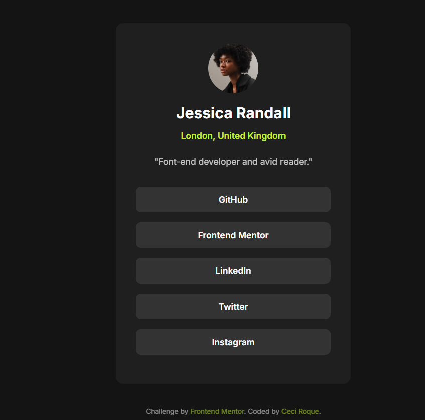

# Social Links Profile 💻✨

Este é um desafio proposto pela plataforma [Frontend Mentor](https://www.frontendmentor.io/challenges/social-links-profile-UG32l9m6d).

## 📸 Preview

## 🔗 Link do projeto

- [🔴 Veja o projeto ao vivo](https://ceci-roque.github.io/social-links-profile/)
- [📁 Repositório no GitHub](https://github.com/Ceci-Roque/social-links-profile)

## 🛠️ Tecnologias usadas

- HTML5
- CSS3
- Flexbox

## 🎯 O que aprendi

- Prática com estrutura semântica em HTML.
- Uso de Flexbox para centralização de elementos.
- Criação de efeitos de hover e responsividade.
- Como seguir um layout base (design JPG) mesmo sem medidas exatas.

## 🚧 Status

Finalizado ✅

## 📌 Créditos

Este projeto faz parte dos desafios gratuitos do [Frontend Mentor](https://www.frontendmentor.io), uma ótima plataforma para treinar desenvolvimento front-end com projetos reais.

---

🧠 _Feito com 💙 por [Ceci](https://github.com/Ceci-Roque)_
